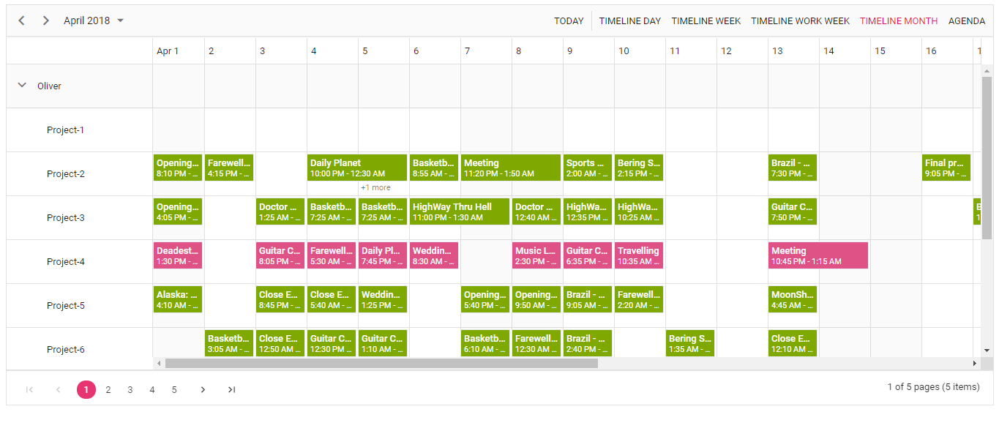

# How to add paging option for Angular Scheduler with multiple resources?
An example application that shows how to add paging option on Angular Scheduler with multiple resources.



## How to run this application?

To run this application, you need to first clone the `How-to-add-paging-option-for-Angular-Scheduler-with-multiple-resources` repository and then navigate to its appropriate path where it has been located in your system.

To do so, open the command prompt and run the below commands one after the other.

```
git clone https://github.com/SyncfusionExamples/How-to-add-paging-option-for-Angular-Scheduler-with-multiple-resources schedule-with-pager
cd schedule-with-pager
```

## Installing

Once done with downloading, next you need to install the necessary packages required to run this application locally. The `npm install` command will install all the needed JS2 packages into your current project and to do so, run the below command.

```
npm install
```

## Running

Finally, you can now use the below `ng` script to run the web application.

```
ng serve
```